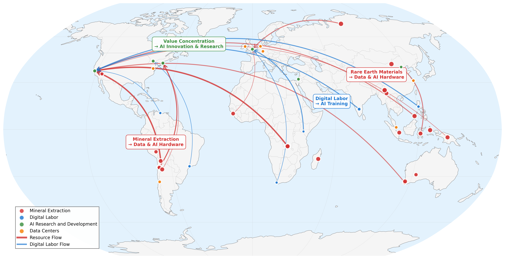

# Lessons from the margins: Contextualizing, reimagining, and hacking Generative AI in Global South

*Andrés Domínguez Hernández¹, Diana Mosquera², Francisco Gallegos²*  
¹ The Alan Turing Institute, London, United Kingdom  
² Diversa, Quito, Ecuador

## Abstract

The impacts of Generative AI in regions of Africa, Asia, and Latin America -with their diverse historical and sociopolitical contexts- are often overshadowed by the hyped and universalising promises of the technology. Global South regions are strategic sites within the global AI value chain grappling with issues of resource exploitation, digital labor outsourcing, and environmental impact. In seeking to overcome the dynamics of extraction, diverse counter-hegemonic responses are contributing to question, adapt and reimagine Gen AI technologies to service the public interest, fundamental rights, and cultural preservation. We draw lessons from how activists, practitioners and thinkers on the margins of AI development, actively assert their autonomy, inspiring a more equitable and culturally responsive digital landscape.

**Keywords:** Generative AI, Global South, Value Chain of AI, Responsible AI, Political Economy


*Figure 1: Global geography of the AI value chain. Curved arrows indicate flows of materials and labor from extraction/production sites to centers of value capture.*

## Repository Contents

### 📊 Dataset: `ai_value_chain.txt`
Comprehensive dataset mapping 49 critical sites across the global AI value chain, including:
- **Mineral extraction sites** (cobalt, lithium, rare earth elements, nickel, copper, tin, bauxite)
- **Digital labor hubs** (data annotation, content moderation, platform work, BPO services)
- **AI research centers** (Silicon Valley, Beijing, London, Boston, Tel Aviv, Toronto)
- **Data center infrastructure** (hyperscale, regional, and tropical facilities)
- **Environmental impact zones** (deforestation, water depletion, habitat destruction)

**Data Fields:**
- Geographic coordinates and regional classification
- Production volumes and workforce data
- Environmental impact scores (1-10 scale)
- Human rights violations documentation
- Key corporate actors and authoritative sources

### 🗺️ Visualization: `hiddengeographies.ipynb`
Notebook that visualizes:
- **Global flow networks** showing resource extraction → technology development patterns
- **AI Value Chain locations** showing important points in Global AI Value Chain

## Research Methodology

This research employs **critical cartography** and **value chain analysis** to reveal the hidden geographies that make AI possible. Our approach:

1. **Multi-source data integration** from academic institutions (Stanford HAI, Harvard IRR), investigative journalism (Global Witness, Human Rights Watch), and industry reports (IEA)
2. **Systematic documentation** of environmental and social impacts across the AI supply chain
3. **Geospatial visualization** revealing patterns of extraction and value concentration
4. **Global South perspective** centering voices and experiences from the margins of AI development

## Data Sources & Methodology

**Primary Sources:**
- Academic research institutions (Stanford HAI, Harvard IRR)
- Investigative journalism organizations (Global Witness, Human Rights Watch, Rest of World)
- International organizations (IEA, EU Commission, Amnesty International)
- Industry reports and company disclosures

**Data Quality:**
- Geographic coordinates verified from multiple sources
- Production volumes based on most recent available data (2022-2024)
- Environmental and human rights assessments from authoritative monitoring organizations
- Cross-referenced across minimum three independent sources per site

We welcome:
- Additional data points from underrepresented regions
- Corrections or updates to existing data
- Alternative visualization approaches
- Critical feedback on methodology

### References

Business & Human Rights Resource Centre. (2024).** *Down to earth: Companies mining energy transition minerals committed hundreds of human rights abuse cases*. Business & Human Rights Resource Centre.
Business Process Enabling South Africa. (2025).** *South Africa's GBS value proposition: 6S's for success*. BPESA. https://www.bpesa.org.za
CorpWatch. (2024).** *Indigenous communities vs. lithium mining: Environmental justice in the Lithium Triangle*. https://corpwatch.org/lithium-mining-impacts
European Commission. (2024).** *Regulation (EU) 2024/1689 laying down harmonised rules on artificial intelligence (AI Act)*. European Union. https://digital-strategy.ec.europa.eu/en/policies/regulatory-framework-ai
Fairwork India. (2024).** *Fairwork India ratings 2024: Labour standards in the platform economy*. Centre for Information Technology and Public Policy, IIIT Bangalore & Oxford Internet Institute. https://fair.work/en/fw/publications/fairwork-india-ratings-2024-labour-standards-in-the-platform-economy/
Friends of the Earth Japan. (2024).** *Nickel mining impacts in Southeast Asia: Community rights and environmental protection*. https://foejapan.org/en/aid/dev/palawan-nickel-mining
Government of Western Australia. (2023).** *Critical minerals strategy 2023-2030*. Department of Jobs, Tourism, Science and Innovation. https://www.wa.gov.au/government/publications/critical-minerals-strategy-2023-2030
Global Witness. (2024).** *The ITSCI laundromat: How a due diligence scheme helps legitimize conflict minerals*. Global Witness.
Gray, M. L., & Suri, S. (2019).** *Ghost work: How to stop Silicon Valley from building a new global underclass*. Houghton Mifflin Harcourt. Ghost WorkMarylgray https://ghostwork.info
Human Rights Watch. (2020).** *Sparkling jewels, opaque supply chains: Jewelry companies, changing sourcing practices, and Covid-19*. Human Rights Watch.
International Energy Agency. (2021).** *The role of critical minerals in clean energy transitions*. IEA. https://www.iea.org/reports/the-role-of-critical-minerals-in-clean-energy-transitions
International Energy Agency. (2025).** *Energy and AI*. IEA. https://www.iea.org/reports/energy-and-ai
Maslej, N., Chio, L., Creel, K., Jia, C., Lam, M., Milyatina, N., Neff, D., Ng, S., Parli, V., Sathe, A., & Wald, R. (2024).** *Global AI Vibrancy Tool 2024: Facilitating cross-country comparisons of AI vibrancy*. Stanford Institute for Human-Centered Artificial Intelligence. https://hai.stanford.edu/news/global-ai-vibrancy-tool-2024
Mining Technology. (2024).** *Artificial intelligence in mining: Applications and industry transformation*. https://www.mining-technology.com/ai-mining/
Minsur S.A. (2023).** *Sustainability report 2022*. https://www.minsur.com/sustainability-report-2022/
MMC Norilsk Nickel. (2024).** *Sustainability report 2023: 20th anniversary non-financial report*. https://www.nornickel.com/sustainability/sustainability-reports/
Posada, J. (2022).** *Embedded in the machine: How AI relies on the global south*. Logic(s) Magazine.
RAID. (2022).** *Beneath the green: A critical look at the cost of industrial cobalt mining in the DRC*. Rights & Accountability in Development.
Rest of World. (2024).** *African content moderators use European data laws to expose Big Tech's opaque AI labor supply chain*. Rest of World. https://restofworld.org/2024/african-content-moderators-data-laws/
Stanford Institute for Human-Centered Artificial Intelligence. (2025). AI Index 2025 report: Measuring trends in artificial intelligence. Stanford University. https://hai.stanford.edu/ai-index/2025-ai-index-report
Stahl, L. (2024, November 3).** The humans training AI in Kenya for Silicon Valley. *60 Minutes*. CBS News. https://www.cbsnews.com/news/ai-training-data-kenya-workers-60-minutes/
Taylor, D. (2024, November).** *Federal IT R&D and AI funding analysis: FY2025 budget supplement*. National Science and Technology Council (NSTC)/National Artificial Intelligence Initiative Office (NAIIO).  Federal Budget IQ. https://www.federalbudgetiq.com
Vale S.A. (2025).** *2024 integrated report*. https://vale.com/sustainability
Visual Capitalist. (2025).** *AI investment by country: A comprehensive look at global AI funding and innovation*. Visual Capitalist. https://www.visualcapitalist.com/ai-investment-by-country/
Wu, A., & Higgins, M. (2023, July).** Generative AI value chain. *Harvard Business School Background Note*, 724-355. Harvard Business School.

## Ethical Considerations

This research aims to:
- Center Global South voices in AI governance discussions in general point of view
- Document environmental and social costs of AI development
- Support advocacy for more equitable technology policies
- Respect the dignity and agency of affected communities

Data collection prioritizes authoritative sources and avoids reproducing harmful narratives while documenting structural inequalities.

## License

```
Creative Commons Attribution 4.0 International License
https://creativecommons.org/licenses/by/4.0/
```

Data is provided for academic research, policy analysis, and advocacy purposes. Commercial use requires explicit permission from the authors.

## Contact

**Diana Mosquera & Francisco Gallegos**
***Diversa***<br> 
📧 [hello@diversa.studio]

**Andrés Domínguez Hernández**
***The Alan Turing Institute***<br> 
📧 [andresdominguez85@gmail.com]

---
